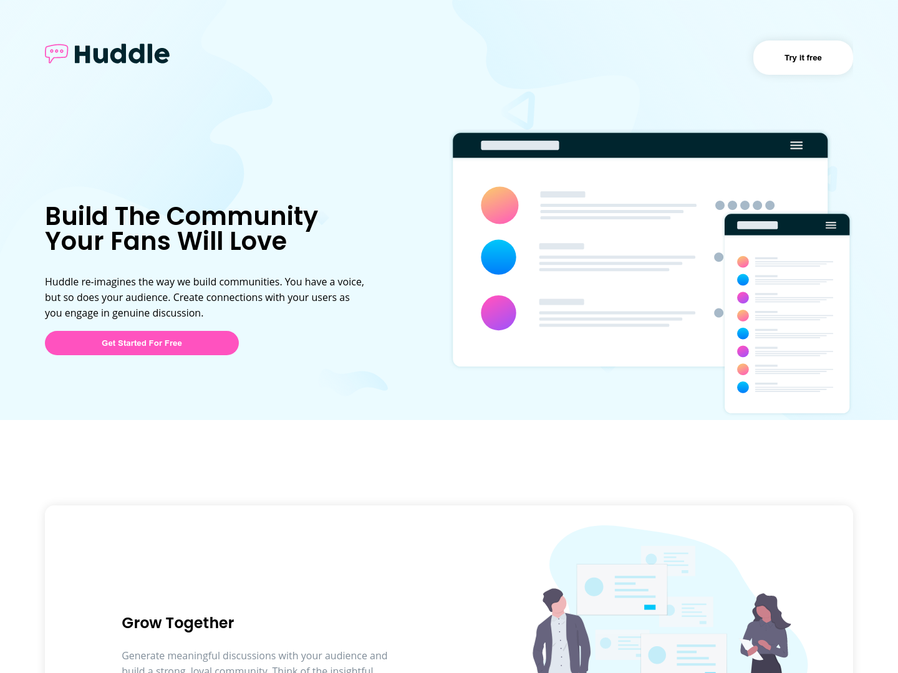
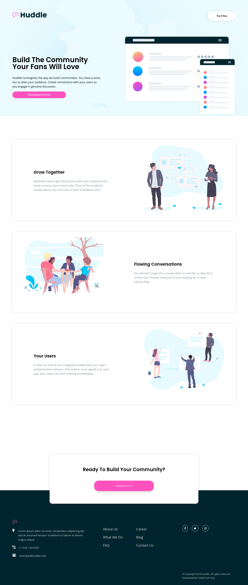

# Coded Tech Guy - Huddle landing page with alternating feature blocks solution

This is a solution to the [Huddle landing page with alternating feature blocks challenge on Frontend Mentor](https://www.frontendmentor.io/challenges/huddle-landing-page-with-alternating-feature-blocks-5ca5f5981e82137ec91a5100). 

Front end mentor provides real live challenges and projects for front end developers to build their skills and showcase their skills. And as such, I decided to take up this challenge. 

## Table of contents

- [Overview](#overview)
  - [The challenge](#the-challenge)
  - [Screenshot](#screenshot)
  - [Links](#links)
- [My process](#my-process)
  - [Built with](#built-with)
- [Author](#author)

## Overview

### The challenge

Developer should develop and build;

- Desktop design provided by Front end mentor
- Mobile design provided by Front end mentor

Users should be able to interact by;

- Seeing hover states for interactive elements such as buttons and links.

### Screenshot

Above are screenshots of the solution to the challenge taken with the Mozilla Firefox web shot tool.

This screenshot (solution) helps you have a look at the contrast between the orignal and the recreated.

Feel free to drop your comments and feedback

### Links

- Solution URL: [Here is a link to the solution on frontendmentor](https://www.frontendmentor.io/solutions/responsive-order-summary-card-using-html-and-css-ryYzcb4S5)
- Live Site URL: [Here is a link to the live site](https://codedtechguy-huddlelandingpage.netlify.app)

## My process

### Built with

- Basic Semantic HTML5 Markup
- CSS3 custom properties

## Author

- Website - [Coded Tech Guy](https://www.your-site.com)
- Frontend Mentor - [@codedtechguy](https://www.frontendmentor.io/profile/codedtechguy)
- Twitter - [@CodedTechGuy](https://www.twitter.com/codedtechguy)
- Github - [@CodedTechGuy](https://www.github.io/codedtechguy)
